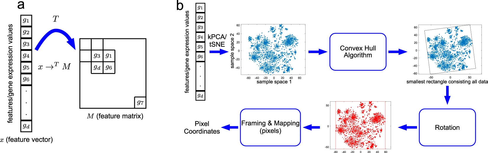
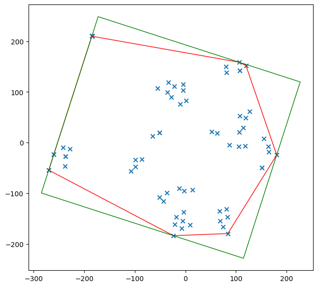
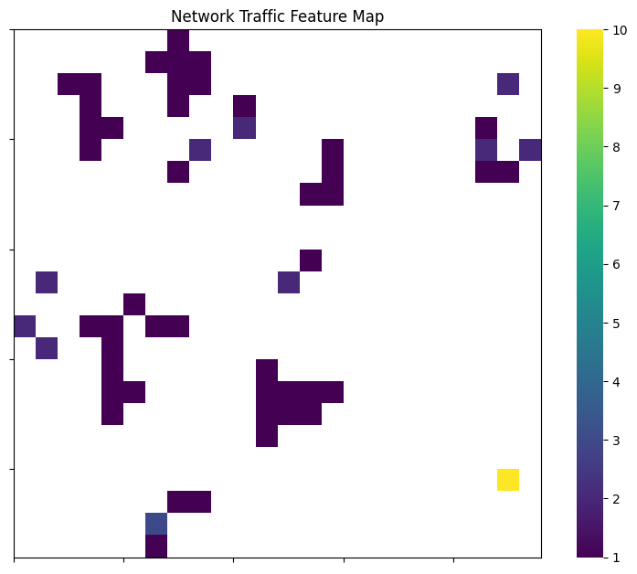
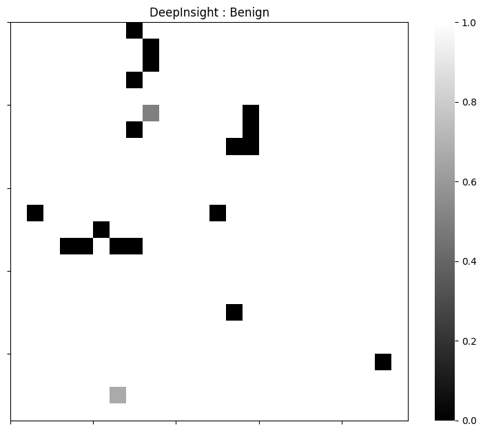
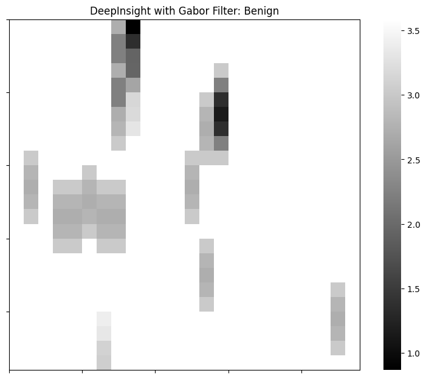

# DeepInsight Transformer

## Description
DeepInsight utilizes [tSNE](https://en.wikipedia.org/wiki/T-distributed_stochastic_neighbor_embedding) to extract features for the creation of a feature map therefore allowing for the transformation of non-image data into image data for [Convolutional Neural Networks](https://en.wikipedia.org/wiki/Convolutional_neural_network). 

### Example Convex Hull and Feature Map
The features extracted from the non-image data are mapped with a convex hull utilized to determine the rotation. The rotation allows for optimization of the images by reducing the overall image size.  

### Example Application of DeepInsight Transformer
An image follows of an example DeepInsight transformation on [CIC-IDS 2017 Dataset](https://www.unb.ca/cic/datasets/ids-2017.html) benign network traffic. The application of the Gabor filter allows for further generalization of the resulting image.  

## Contributing
If you want to contribute to the package, you are welcome to do so. You can contribute by reporting bugs, suggesting new features, or submitting pull requests.

## References
Original Source: [pyDeepInsight](https://github.com/alok-ai-lab/pyDeepInsight)  
[DeepInsight: A methodology to transform a non-image data to an image for convolution neural network architecture](https://www.nature.com/articles/s41598-019-47765-6)

## License
The package is licensed under the Apache License. You can use it for both commercial and non-commercial purposes. 

The Apache License is a permissive open-source software license that allows users to freely use, modify, and distribute software that is licensed under it. The license was developed by the Apache Software Foundation and is one of the most widely used open-source licenses.

The Apache License allows users to use, distribute, and modify the software for any purpose, including commercial use, without having to pay royalties or fees to the original developer. The license also provides patent protection to users of the software, which means that if someone contributes patented code to a project, they are granting a license to use that code to all users of the project.

In addition, the Apache License requires that any modifications to the original software be clearly marked and attributed to the person or organization that made them. The license also includes a disclaimer of liability, which means that the original developer cannot be held liable for any damages caused by the use or modification of the software.

See the LICENSE file for more details.
